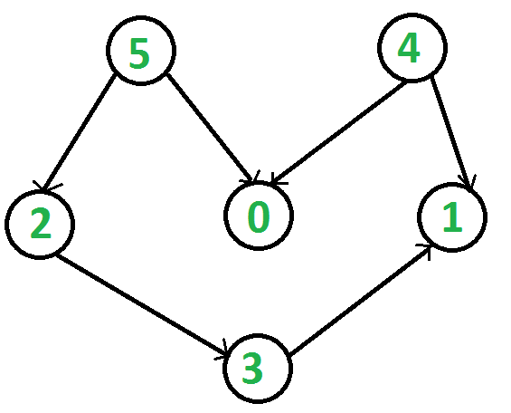

# Kahn's Algorithm for Topological Sorting
***

## Algorithm Description

The approach is based on the below fact:

<Strong>A DAG G has at least one vertex with in-degree 0 and one vertex with out-degree 0.</Strong>

<Strong>Proof</Strong>: There’s a simple proof to the above fact is that a DAG does not contain a cycle which means that all paths will be of finite length. Now let S be the longest path from u(source) to v(destination). Since S is the longest path there can be no incoming edge to u and no outgoing edge from v, if this situation had occurred then S would not have been the longest path 
=> indegree(u) = 0 and outdegree(v) = 0.

<Strong>Algorithm</Strong>: Steps involved in finding the topological ordering of a DAG: 

<Strong>Step-1</Strong>: Compute in-degree (number of incoming edges) for each of the vertex present in the DAG and initialize the count of visited nodes as 0.
 
<Strong>Step-2</Strong>: Pick all the vertices with in-degree as 0 and add them into a queue (Enqueue operation).
 
<Strong>Step-3</Strong>: Remove a vertex from the queue (Dequeue operation) and then. 
 
    1. Increment count of visited nodes by 1.
    2. Decrease in-degree by 1 for all its neighbouring nodes.
    3. If in-degree of a neighbouring nodes is reduced to zero, then add it to the queue.
 
<Strong>Step-4</Strong>: Repeat Step 3 until the queue is empty.
 
<Strong>Step-5</Strong>: If count of visited nodes is not equal to the number of nodes in the graph then the topological sort is not possible for the given graph.

## Example

#### <Strong>Input</Strong>:
<h1 align="center">
	
	 
	 
</h1>

#### <Strong>Output</Strong>: 4 5 2 0 3 1 
#### <Strong>Explanation</Strong>: The topological sorting of a DAG is done in a order such that for every directed edge uv, vertex u comes before v in the ordering. 4 has no incoming edge. 5 has no incoming edge, 2 and 0 have incoming edge from 4 and 5 and 1 is placed at last. Another topological sorting of the following graph is “5 4 2 3 1 0″. 

 

***

## Reference

* [GeeksforGeeks] (https://www.geeksforgeeks.org/topological-sorting-indegree-based-solution/)
