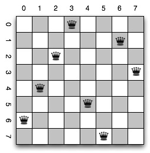

## N Queens Problem ##

Given a chess board with NxN cells, we want to know if it is possible to
put N queens in board in such way that no queen is attacked by another.
A queen attack in the row, column and diagonal of its position.

Like others backtracking problems, this can be solve put queens in
positions that are not attacked until there is not option. So, we remove
the last queen from its position and put in another valid position.

## A example solution of N Queens Problem with N = 8 ##

