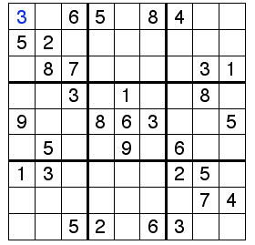

### Sudoku using backtracking
Like all other Backtracking problems, we can solve Sudoku by one by one assigning numbers to empty cells. Before assigning a number, we check whether it is safe to assign. We basically check that the same number is not present in current row, current column and current 3X3 subgrid. After checking for safety, we assign the number, and recursively check whether this assignment leads to a solution or not. If the assignment doesn’t lead to a solution, then we try next number for current empty cell. And if none of number (1 to 9) lead to solution, we return false.

#### A graphical example of Sudoku using backtracking

