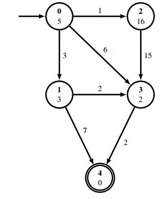

# A Star Search
Is a form of informed search algorithm. It finds paths from a node to another node by searching all possible paths to the goal for the one bearing the smallest distance travelled (or shortest time, or other metrics, depending on usage).

To do that it not only uses the cost of taking paths but also the heuristic that specifies the guessed costs from a node to the goal.

More details can be found [here](https://en.wikipedia.org/wiki/A*_search_algorithm)

# Python
## Explanation
**Implementation**: Uses graph-search, so that we do not visit nodes more than once and can be easily modified to be used for other graph-search algorithms by changing the fringe data structure and calculaton of `f`.

**Input files** have a specific format:
- first line reads n(#of nodes) and e(# of edges)
- lines 2 to n+1 contain the heuristic values of the nodes
- lines n+2 to the end represent edges in this way: from to value e.g. from 0 to 1 with cost 3 (in01.in)
  :param filename: name of the input file. e.g. 01.in

*Example Graph*:

```
5 7   # 5 nodes [0..4], 7 edges
5     # heuristic values of node (0) - (4)
3
16
2
0     # end of heuristic values
0 1 3 # begin path specification, from (0) to (1) with cost 3
0 2 1
0 3 6
1 3 2
1 4 7
2 3 15
3 4 2
```

**Output files**:
Contain a python array as a string that will be compared to the solution. E.g. a* output is `[0, 1, 3, 4]` and our file contains `"[0, 1, 3, 4]"` means that we found the correct path.
