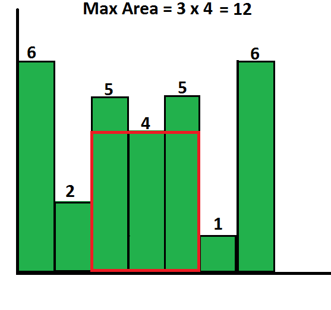

# Find The Largest Rectangle in a Histogram

Find the largest rectangular area possible in a given histogram where the largest rectangle can be made of a number of contiguous bars whose heights are given in an array. Further assume that all bars have the same width and the width is 1 unit.

Example:

**Input:** histogram = {6, 2, 5, 4, 5, 1, 6}

**Output:** 12

Example:

**Input:** histogram = {3, 5, 1, 7, 5, 9}

**Output:** 15