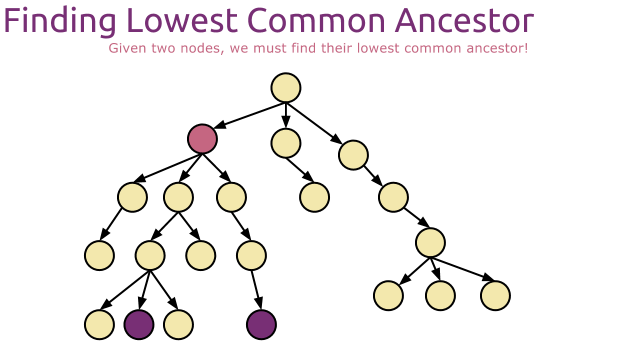

# Lowest Common Ancestor

In graph theory and computer science, the lowest common ancestor (LCA) of two nodes v and w in a tree or directed acyclic graph (DAG) T is the lowest (i.e. deepest) node that has both v and w as descendants, where we define each node to be a descendant of itself (so if v has a direct connection from w, w is the lowest common ancestor).

The LCA of v and w in T is the shared ancestor of v and w that is located farthest from the root. Computation of lowest common ancestors may be useful, for instance, as part of a procedure for determining the distance between pairs of nodes in a tree: the distance from v to w can be computed as the distance from the root to v, plus the distance from the root to w, minus twice the distance from the root to their lowest common ancestor.

