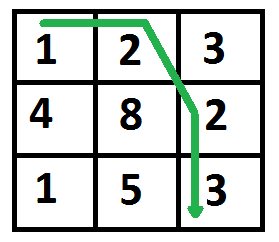

### Minimum Cost Path algorithm

Given a cost matrix cost[][] and a position (m, n) in cost[][], write a function that returns cost of minimum cost path to reach (m, n) from (0, 0). Each cell of the matrix represents a cost to traverse through that cell. Total cost of a path to reach (m, n) is sum of all the costs on that path (including both source and destination). You can only traverse down, right and diagonally lower cells from a given cell, i.e., from a given cell (i, j), cells (i+1, j), (i, j+1) and (i+1, j+1) can be traversed. You may assume that all costs are positive integers.

#### A graphical example of Minimum Cost Path algorithm

