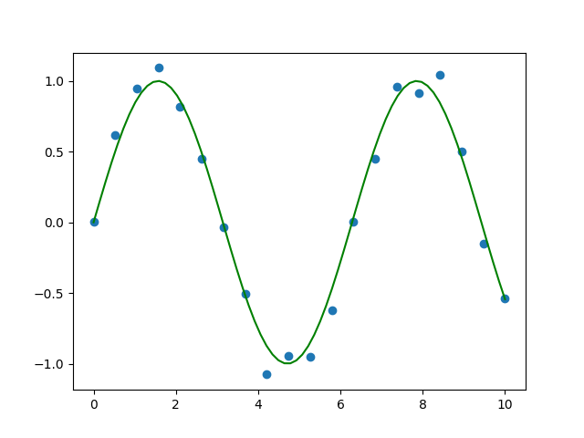
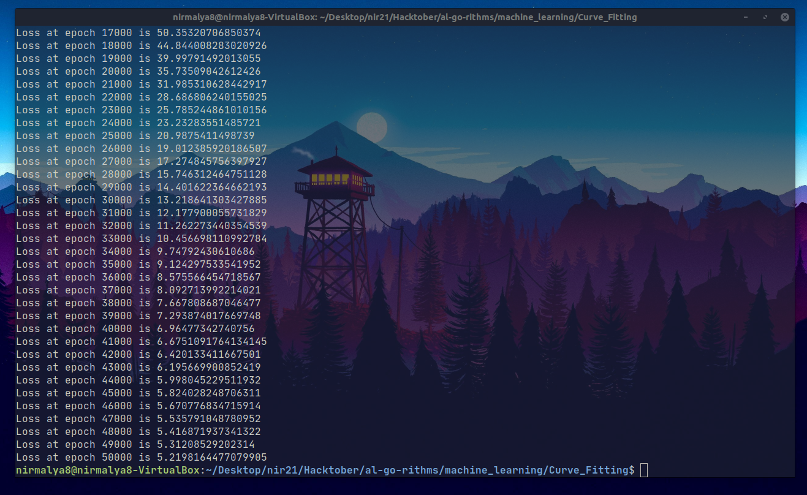
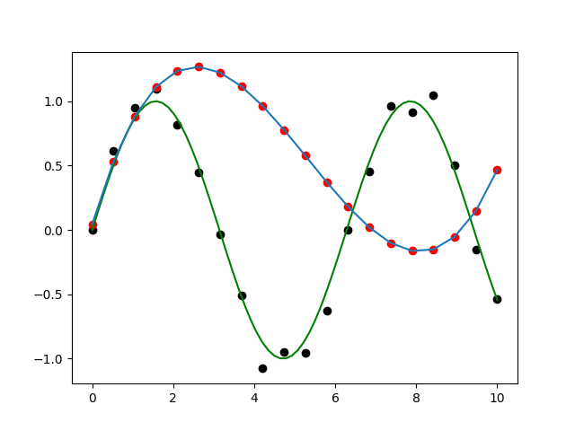

## Curve Fitting: Theory and Implementation

The main goal of `fit_curve.py` is to fit a polynomial function into some custom dataset and check the results. The code has been divided into functions, which follows a certain workflow, or a few steps. As the dataset is custom, it makes sense to create it first.

# Creating the Dataset
We will base our dataset on the sine function. Now, we want to create a dataset, which will be well approximated by the sine function. For that purpose, it makes sense to add some random noise to the values given by the sine function. This will make our dataset somewhat different from the sine function but the sine function will be able to approximate the dataset very well. Another reason for adding noise is that most real world datasets contain noise.

Hence, we can consider the sine function to be the benchmark we want to attain with our polynomial. The graph given below proves it. Here, the curve `y=sin(x)` is shown by the green curve and the blue points show the points of the dataset. 

# Theory of Curve Fitting

So, let us first define the problem. We want to fit the sine curve with a polynomial of degree n. The polynomial will be of the form - 

$$ y = w_0 x^0+w_1x^1+w_2x^2+\dots+w_nx^n $$

This can also be written as :

$$ y = \sum_{i=0}^{n} {w_ix^i}$$

If we dive deeper into the Mathematics, we find that this can be represented as:

$$ w =  [w_0, w_1,\dots,w_n]$$

$$ x =  [x, x^2,x^3,\dots,x^n]$$

So, y can be written as

$$ y = w^Tx   $$

We will apply the final equation, taking the values of w and powers of x to find an output.

For this problem, we will be using a 3-degree polynomial.

# Loss function and Gradient calculation
For the purpose of this problem statement, we will use the  Mean Squared Error function as the loss function.

$$ Error(x,y,w) = Mean\ (Predicted\ value - Actual\ Value )^2 $$

The method for calculating gradients has also been written from scratch using:
$$ \frac {d f(a)}{dh} =   \lim_{h\to0} \left[\frac {f(a+h)-f(a)}{h} \right]  $$

It takes the loss function, weight vector, x, y values, the value h which is near 0 and finally val. Val is basically the index of the weight matrix, on the basis of which we want to calculate the derivative.

# Creating the Model
The model is trained using the following steps: 
1. Compute gradients of the loss function for each of the values in the weight vector.
2. Update the weights: $w_i = w_i - \alpha*gradient(w_i)$ Where $\alpha$ is the learning rate.
3. Continue these steps for the number of epochs given.

We will use the gradient descent optimization technique.

# Results

Inference: If we see point for point, the difference is not much. The 3-degree polynomial has lesser degrees of freedom but still has somewhat captured the function(Red dots and Blue Line).
