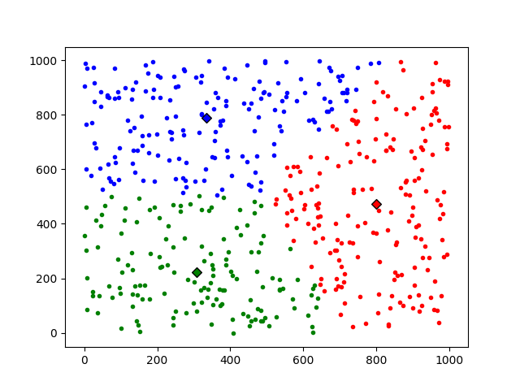

# K-Means Clustering
Is a useful algorithm to find groups (clusters) in data. The algorithm let's you group a huge number of points (2d) into k clusters. Read [more](https://en.wikipedia.org/wiki/K-means_clustering).

## Python
The algorithm first places k random points as centroids for the points and then fits them into the given data. Afterwards you do two steps in a loop:
1. Find the nearest centroid for each point
2. Iterate over all centroids and check if you should modify the position to be more in the center of the children.
    - Set the flag to iterate one more time if you find one centroid whose position should be modified

Result looks like this:
You will have k groups of points that you can now further process.

