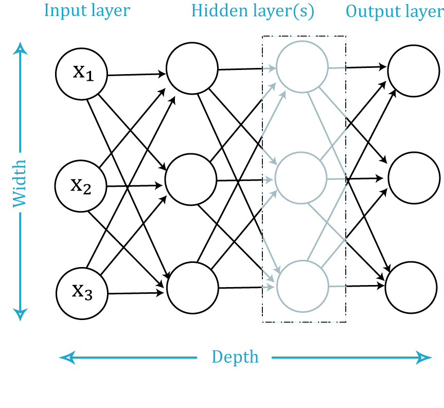

# Deep Learning and Artificial Neural Networks

## Neural Networks
Artificial neural networks (ANN) or connectionist systems are computing systems vaguely inspired by the biological neural networks that constitute animal brains.[1] Such systems "learn" to perform tasks by considering examples, generally without being programmed with any task-specific rules. For example, in image recognition, they might learn to identify images that contain cats by analyzing example images that have been manually labeled as "cat" or "no cat" and using the results to identify cats in other images. They do this without any prior knowledge about cats, e.g., that they have fur, tails, whiskers and cat-like faces. Instead, they automatically generate identifying characteristics from the learning material that they process.

An ANN is based on a collection of connected units or nodes called artificial neurons which loosely model the neurons in a biological brain. Each connection, like the synapses in a biological brain, can transmit a signal from one artificial neuron to another. An artificial neuron that receives a signal can process it and then signal additional artificial neurons connected to it.

In common ANN implementations, the signal at a connection between artificial neurons is a real number, and the output of each artificial neuron is computed by some non-linear function of the sum of its inputs. The connections between artificial neurons are called 'edges'. Artificial neurons and edges typically have a weight that adjusts as learning proceeds. The weight increases or decreases the strength of the signal at a connection. Artificial neurons may have a threshold such that the signal is only sent if the aggregate signal crosses that threshold. Typically, artificial neurons are aggregated into layers. Different layers may perform different kinds of transformations on their inputs. Signals travel from the first layer (the input layer), to the last layer (the output layer), possibly after traversing the layers multiple times.

The original goal of the ANN approach was to solve problems in the same way that a human brain would. However, over time, attention moved to performing specific tasks, leading to deviations from biology. Artificial neural networks have been used on a variety of tasks, including computer vision, speech recognition, machine translation, social network filtering, playing board and video games and medical diagnosis.

## Deep Learning

We have seen that ANNs mimic the architecture of the human brain. Hence training the model is akin to how humans learn, hence the term 'learning'.  **But what makes it deep?**

The true power of an ANN comes from the level of abstraction obtained by using many layers:

The number of layers that aren't input or output layers are referred to as _hidden_ layers. The greater the number of hidden layers, the deeper the model. An ANN currently may be considered 'deep' if there are six or more layers.

Even a simple ANN architecture is capable of approximating any arbitrary function to incredible precision---they are sometimes referred to as a type of 'universal approximator'. However, the level of abstraction capable from a legitimately deep learning algorithm is truly astounding.
