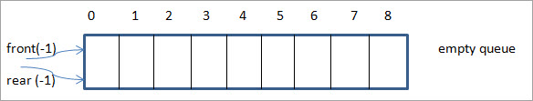

## Description of a Queue

> The queue is a basic data structure just like a stack. In contrast to stack that uses the LIFO approach, queue uses the FIFO (first in, first out) approach. With this approach, the first item that is added to the queue is the first item to be removed from the queue. Just like Stack, the queue is also a linear data structure.

> In a real-world analogy, we can imagine a bus queue where the passengers wait for the bus in a queue or a line. The first passenger in the line enters the bus first as that passenger happens to be the one who had come first.

## Queue with C++

## Basic Operations

> The queue data structure includes the following operations:

* EnQueue: Adds an item to the queue. Addition of an item to the queue is always done at the rear of the queue.
* DeQueue: Removes an item from the queue. An item is removed or de-queued always from the front of the queue.
* isEmpty: Checks if the queue is empty.
* isFull: Checks if the queue is full.
* peek: Gets an element at the front of the queue without removing it.

### Enqueue
> In this process, the following steps are performed:

1. Check if the queue is full.
2. If full, produce overflow error and exit.
3. Else, increment ‘rear’.
4. Add an element to the location pointed by ‘rear’.
5. Return success.

### Dequeue
> Dequeue operation consists of the following steps:

1. Check if the queue is empty.
2. If empty, display an underflow error and exit.
3. Else, the access element is pointed out by ‘front’.
4. Increment the ‘front’ to point to the next accessible data.
5. Return success.

## Examples/Applications Of Queue

> Let us discuss the various applications of the queue data structure below.

* The queue data structure is used in various CPU and disk scheduling. Here we have multiple tasks requiring CPU or disk at the same time. The CPU or disk time is scheduled for each task using a queue.
* The queue can also be used for print spooling wherein the number of print jobs is placed in a queue.
* Handling of interrupts in real-time systems is done by using a queue data structure. The interrupts are handled in the order they arrive.
* Breadth-first search in which the neighboring nodes of a tree are traversed before moving on to next level uses a queue for implementation.
* Call center phone systems use queues to hold the calls until they are answered by the service representatives.
* In general, we can say that the queue data structure is used whenever we require the resources or items to be serviced in the order they arrive i.e. First in, First Out.

## Conclusion

> The queue is a FIFO (First In, First Out) data structure that is mostly used in resources where scheduling is required. It has two pointers rear and front at two ends and these are used to insert an element and remove an element to/from the queue respectively.

> Reference: https://www.softwaretestinghelp.com/queue-in-cpp/