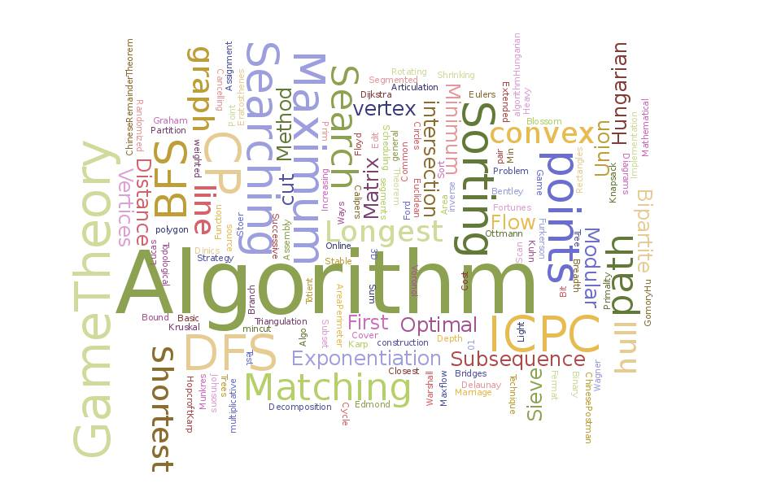

<h1 align="center">
	
	 
	 
</h1>

# Data Structures and Algorithms 

Clean example implementations of data structures and algorithms written in different languages.

## List of implementations

[Algorithms list](https://github.com/ZoranPandovski/al-go-rithms/blob/master/IMPLEMENTATIONS.md)

## Contribution
 * Contributions are always welcome. Language doesn't matter. Just make sure you're implementing an algorithm.
 * PRs are welcome. To begin developing, follow the structure:

   > algorithm_name/language-name/file_name.extension
   e.g
   > bubble_sort/python/bubble_sort.py

 * If there is an implementation of the same algorithm in your language, add your username in front of the file name.
 * Please include a description for the algorithm that you are implementing. It doesn't matter if it's copied from somewhere as long as it helps people that are learning new algorithm.
 * Graphical examples would be very helpful too.
 * Don't forget to include tests.
 * Don't remove previous implementations of algorithms. Just add a new file with your own implementation.
 * Beautify and cleanup your code for easier reading.

## Resources

 Curated list of resources dealing with algorithms.

 * **Books**
   * [Introduction to algorithms](https://www.amazon.com/Introduction-Algorithms-Second-Edition-Thomas/dp/0262032937)
   * [Algorithms and Data structures](https://www.amazon.com/Algorithms-Structures-Prentice-Hall-Automatic-Computation/dp/0130224189)
   * [Data Structures and Algorithms](https://www.amazon.com/Data-Structures-Algorithms-Alfred-Aho/dp/0201000237/ref=pd_sim_14_3?_encoding=UTF8&pd_rd_i=0201000237&pd_rd_r=XQVWWBZYKCYN7V573D1B&pd_rd_w=jmpvR&pd_rd_wg=FCwc5&psc=1&refRID=XQVWWBZYKCYN7V573D1B)
   * [The Algorithm Design Manual](https://www.amazon.com/Algorithm-Design-Manual-Steven-Skiena/dp/1849967202)
   * [Algorithm Design](https://www.amazon.com/Algorithm-Design-Jon-Kleinberg/dp/0321295358)
   * [Grokking Algorithms](https://www.amazon.com/Grokking-Algorithms-illustrated-programmers-curious/dp/1617292230/ref=zg_bs_3870_3?_encoding=UTF8&psc=1&refRID=CBQSARF3C86P7FMQ4DEV)
   * [Algorithms](https://www.amazon.in/Algorithms-Robert-Sedgewick/dp/032157351X)
   * [Competitive Programming 3](https://www.amazon.com/Competitive-Programming-3rd-Steven-Halim/dp/B00FG8MNN8)
 * **Sites**
   * [Algorithms and Data Structures -Emaxx](https://cp-algorithms.com/algebra/extended-euclid-algorithm.html)
   * [All Good Tutorials on Codeforces](http://codeforces.com/blog/entry/57282)
   * [DS & Algo + Maths + C++](http://codeforces.com/blog/entry/13529)
   * [Data Structures and Algorithms](https://discuss.codechef.com/questions/48877/data-structures-and-algorithms)
   * [Algorithms - Tutorials point](https://www.tutorialspoint.com/data_structures_algorithms/index.htm)
   * [Algorithms - Princetone edu](https://algs4.cs.princeton.edu/home/)
   * [Data structures and algorithms - Hackr](https://hackr.io/tutorials/learn-data-structures-algorithms)
   * [Data science - Topcoder](https://www.topcoder.com/community/data-science/data-science-tutorials/)
   * [Fundamentals Of Algorithms- Geeks For Geeks](https://www.geeksforgeeks.org/fundamentals-of-algorithms/)
   * [Visual Algorithm - visualising data structures and algorithms through animation](https://visualgo.net/en)
   * [Java Algorithms - Geeks For Geeks](https://www.geeksforgeeks.org/top-algorithms-and-data-structures-for-competitive-programming/)
   * [Data Structure and Algorithms Visualization](https://www.cs.usfca.edu/~galles/visualization/Algorithms.html)
   * [Best Data structures and algorithms Tutorials - Coursesity](https://coursesity.com/best-tutorials-learn/data-structure-algorithm)

* **Online classes (Free)**
  * Coursera 
      * [Introduction to algorithms Part 1](https://www.coursera.org/learn/introduction-to-algorithms)
      * [Algorithms specialization 4 courses](https://www.coursera.org/specializations/algorithms)
   * Khan Academy 
     * [Algorithms](https://www.khanacademy.org/computing/computer-science/algorithms)
   * Udacity
      * [Computability, Complexity & Algorithms](https://www.udacity.com/course/computability-complexity-algorithms--ud061)
      * [Intro to algorithms](https://www.udacity.com/course/intro-to-algorithms--cs215)
   * EdX
      * [Algorithms](https://www.edx.org/course/algorithms-iitbombayx-cs213-3x-0)
      * [Algorithms and data structures](https://www.edx.org/course/algorithms-data-structures-microsoft-dev285x)
     * [Algorithm Design and Analysis](https://courses.edx.org/courses/course-v1:PennX+SD3x+2T2017/course/)
     * [Graph Algorithms](https://www.edx.org/course/graph-algorithms-uc-san-diegox-algs202x)
     * [Data Structures](https://www.edx.org/course/data-structures-uc-san-diegox-algs201x)
      * [Algorithmic Design and Techniques](https://www.edx.org/course/algorithmic-design-techniques-uc-san-diegox-algs200x)
     * [String Processing and Pattern Matching Algorithms](https://www.edx.org/course/string-processing-pattern-matching-uc-san-diegox-algs204x)
     * [Graph Algorithms in Genome Sequencing](https://www.edx.org/course/graph-algorithms-genome-sequencing-uc-san-diegox-algs206x)
     * [Algorithms and Data Structures Capstone](https://www.edx.org/course/algorithms-data-structures-capstone-uc-san-diegox-algs207x)
   * Stony Brook University
     * [Skiena's algorithms lectures](http://www3.cs.stonybrook.edu/~algorith/video-lectures/)
* **Online classes (paid)**
  * Udemy 
      * [The Coding Interview Bootcamp: Algorithms + Data Structures](https://www.udemy.com/coding-interview-bootcamp-algorithms-and-data-structure/)
      * [JavaScript Algorithms and Data Structures Masterclass](https://www.udemy.com/js-algorithms-and-data-structures-masterclass/)
      * [Learning Algorithms in JavaScript from Scratch](https://www.udemy.com/learning-algorithms-in-javascript-from-scratch/)
 * **Coding Practice Sites**
    * [HackerRank](https://www.hackerrank.com/)
    * [HackerEarth](https://www.hackerearth.com/)
    * [SPOJ](https://www.spoj.com/)
    * [TopCoder](https://www.topcoder.com/)
    * [CodeChef](https://www.codechef.com/)
    * [Codeforces](https://codeforces.com/)
    * [Project Euler](https://projecteuler.net/)
    * [LeetCode](https://leetcode.com/)
    * [CodingGame](https://www.codingame.com/)
    * [CodeWars](https://codewars.com/)
    * [InterviewBit](https://www.interviewbit.com/courses/programming/)
    * [TechGig](https://www.techgig.com/)
    * [Careercup](https://www.careercup.com/)
    * [AtCoder](https://atcoder.jp/)
    * [Codejam](https://code.google.com/codejam/)
    * [Exercism](https://exercism.io/)
    * [freeCodeCamp](https://www.freecodecamp.org/)
    * [CodingBat](https://codingbat.com)
    * [CodeGround](https://codeground.in/online-coding-test.html)
    * [CoderByte](https://coderbyte.com/)
    * [Geeks For Geeks](https://practice.geeksforgeeks.org)
    * [Kattis](https://open.kattis.com/)
    * [Codility](https://www.codility.com/)

## License

To the extent possible under law, [Zoran Pandovski](https://github.com/ZoranPandovski/) has waived all copyright and related or neighboring rights to this work.
