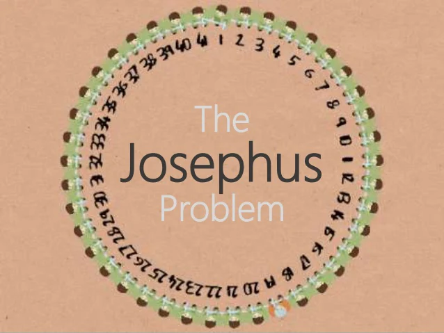

# Josephus Problem
***

## Algorithm Description

This is a standard problem asked in many interviews. 

<h1 align="center">
	
	 
	 
</h1>

* [Image Source] (https://www.slideshare.net/khshamim1/josephus-problem)

**Problem**: There are n people standing in a circle waiting to be executed. The counting out begins at some point in the circle and proceeds around the circle in a fixed direction. In each step, a certain number of people are skipped and the next person is executed. The elimination proceeds around the circle (which is becoming smaller and smaller as the executed people are removed), until only the last person remains, who is given freedom. Given the total number of persons n and a number k which indicates that k-1 persons are skipped and kth person is killed in circle. The task is to choose the place in the initial circle so that you are the last one remaining and so survive.

## Example

#### Input

n=5 , k=2

#### Output

Safe Position = 3

#### <Strong>Explanation</Strong>

If n = 5 and k = 2, then the safe position is 3. Firstly, the person at position 2 is killed, then person at position 4 is killed, then person at position 1 is killed. Finally, the person at position 5 is killed. So the person at position 3 survives. 

 

***

## Reference

* [GeeksforGeeks] (https://www.geeksforgeeks.org/josephus-problem-set-1-a-on-solution/)
