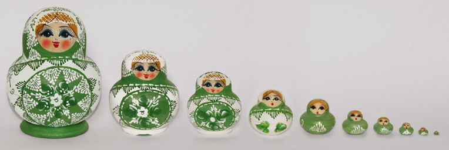
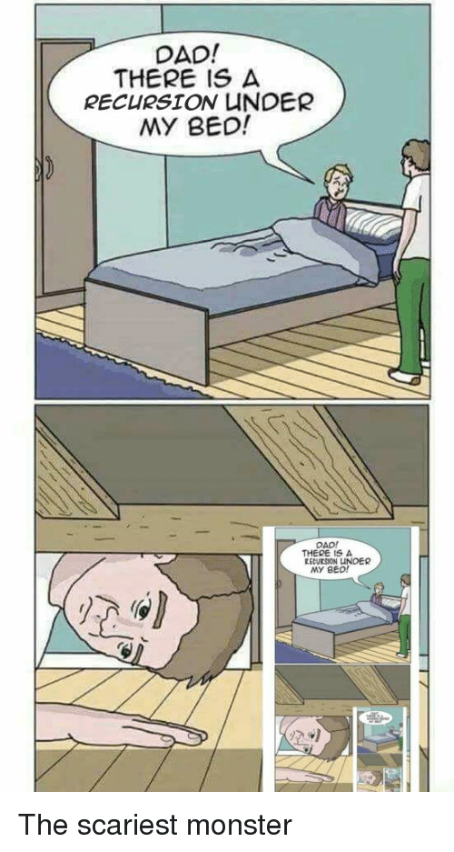

## Recursion

To understand recursion, you must first understand recursion.

> Recursive algorithm is a method of simplification that divides the problem into sub-problems of the same nature. The result of one recursion is the input for the next recursion. The repletion is in the self-similar fashion. The algorithm calls itself with smaller input values and obtains the results by simply performing the operations on these smaller values. Generation of factorial, Fibonacci number series are the examples of recursive algorithms.

Generally, all recursive algorithm must have the following three stages:

1. Base Case: If a certain condition is reached, return a certain value and break the recursion;
2. Work toward base case: A new value is generated that works towards the desired condition of the base case.
3. Recursive Call: The value generated in step 2 is plugged into the recursive algorithm and the process starts over at step 1;

> In the simplest terms, think of recursion like a set of russian dolls. You crack open the largest one to find a slightly smaller one inside. This is not the doll you are looking for, so you repeat the process and crack open the largest one to find a slightly smaller one inside. Eventually, you find a doll (the smallest) that will not crack open. You reached your base case and have found the correct doll by shedding the larger dolls away with each repeat of the process.

